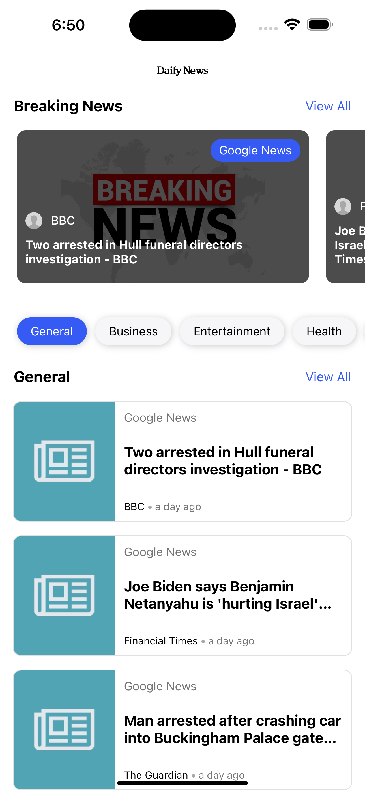
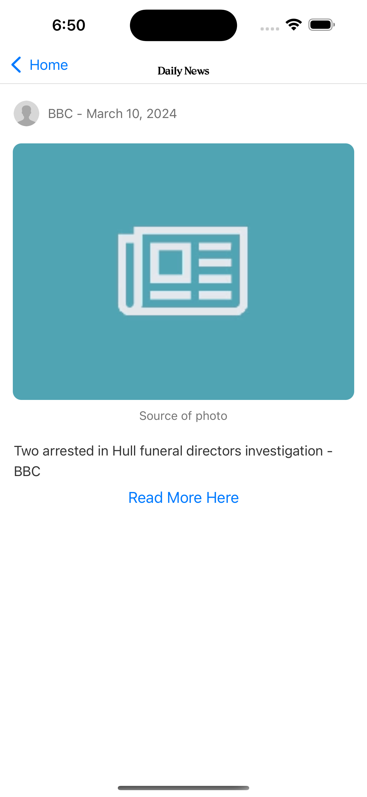

# News Reader App

## Running the React Native Project for Android and iOS

Welcome to my React Native project! Follow the steps below to run the app on both Android and iOS platforms.

### Prerequisites

- Node.js installed on your machine
- npm or Yarn package manager
- React Native CLI
- Android Studio (for Android development)
- Xcode (for iOS development)

### Steps

1. **Clone the Repository:**

   ```bash
   git clone https://github.com/syedhaider03/news_reader_app.git
   ```

2. **Install Dependencies:**

   ```bash
   cd news_reader_app
   npm install
   # or
   yarn install
   ```

3. **For Android:**

   - Ensure you have an Android device connected or an Android emulator running.
   - Run the following command:
     ```bash
     npx react-native run-android
     ```

4. **For iOS:**
   - Ensure you have a macOS device with Xcode installed.
   - Run the following command:
     ```bash
     npx react-native run-ios
     ```

## Functionality

The app features a user-friendly home page with two main sections:

### Headlines from All Categories

This section presents users with the latest headlines across a variety of news categories, ensuring they stay informed with the most recent updates.

### Category Pills

Located just below the headlines, this interactive segment contains pills representing different news categories. Users can effortlessly select a category of interest, and the headline list will dynamically update to reflect their choice.

### App Screenshots




### Design Inspiration


I acknowledge and appreciate the creativity of designers on Dribbble.

### Environment File

Please make sure to add an `.env` file in the root folder of the project. This file should contain necessary environment variables, particularly for APIs to function properly.

### Author

- @syedhaider03
